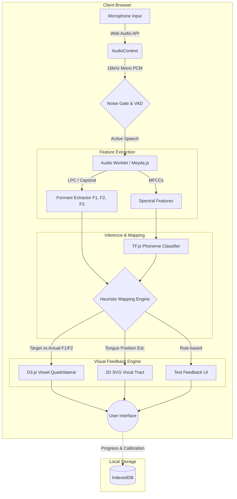

# Articulatory Feedback Pronunciation Coach - Technical Specification

## 1. System Architecture Diagram

## 2. Technology Stack Table

| Component | Primary Technology | Purpose | Alternatives Considered |
| :--- | :--- | :--- | :--- |
| **Frontend Framework** | React + TypeScript | Component-based UI, state management, type safety | Vue.js, Svelte |
| **Styling** | Tailwind CSS | Rapid, consistent styling with medical-aesthetic | CSS Modules, Styled Components |
| **Audio Capture** | Web Audio API | Low-latency audio routing and processing | MediaRecorder API (too high latency) |
| **Feature Extraction** | Meyda.js | Real-time MFCC and spectral feature extraction | Custom Web Audio Worklet (C++/WASM) |
| **Formant Tracking** | Custom LPC Algorithm | Extracting F1/F2/F3 for vowel mapping | Praat (Server-side, violates privacy constraint) |
| **Data Visualization** | D3.js | Rendering the Vowel Quadrilateral (F1/F2 plot) | Chart.js, Recharts (less customizable) |
| **Tract Visualization** | React SVG / Framer Motion | 2D deformable tongue mesh animation | HTML5 Canvas |
| **ML Inference** | TensorFlow.js | Client-side phoneme classification | ONNX Runtime Web |
| **Local Storage** | IndexedDB (Dexie.js) | Storing user calibration and progress locally | localStorage (size limits) |

## 3. Phoneme Coverage Matrix

Focusing on 10 high-value minimal pair contrasts for B1-B2 ESL learners.

| Target Phoneme | Example Word | Acoustic Features (Approx.) | Visual Strategy (Tongue/Lips) | Feedback Heuristic |
| :--- | :--- | :--- | :--- | :--- |
| **/iː/** (Fleece) | *beat* | Low F1 (~300Hz), High F2 (~2200Hz) | Tongue high & front, lips unrounded | If F2 < 1800Hz: "Push tongue forward" |
| **/ɪ/** (Kit) | *bit* | Mid-Low F1 (~400Hz), Mid-High F2 (~1800Hz) | Tongue slightly lower & further back than /iː/ | If F1 < 350Hz: "Relax jaw slightly" |
| **/æ/** (Trap) | *bat* | High F1 (~700Hz), Mid-High F2 (~1600Hz) | Tongue low & front, jaw open | If F1 < 600Hz: "Drop your jaw more" |
| **/ʌ/** (Strut) | *but* | Mid-High F1 (~600Hz), Mid F2 (~1200Hz) | Tongue mid-low & central | If F2 > 1400Hz: "Pull tongue back slightly" |
| **/uː/** (Goose) | *boot* | Low F1 (~300Hz), Low F2 (~800Hz) | Tongue high & back, lips rounded | If F2 > 1000Hz: "Round lips more, tongue back" |
| **/ʊ/** (Foot) | *book* | Mid-Low F1 (~450Hz), Mid-Low F2 (~1000Hz) | Tongue slightly lower & forward than /uː/ | If F1 < 350Hz: "Relax lips and jaw" |
| **/ɑː/** (Palm) | *bot* | High F1 (~750Hz), Mid-Low F2 (~1100Hz) | Tongue low & back, jaw fully open | If F1 < 600Hz: "Open mouth wider" |
| **/θ/** (Voiceless TH) | *think* | High-freq noise (>4kHz), flat spectrum | Tongue tip between teeth | If noise < 4kHz: "Bring tongue between teeth" |
| **/s/** (Voiceless S) | *sink* | Very high-freq noise (>6kHz), sharp peak | Tongue blade near alveolar ridge | If noise < 5kHz: "Move tongue tip up behind teeth" |
| **/r/ vs /l/** | *read/lead* | /r/: Low F3 (<2000Hz). /l/: High F3 (>2500Hz) | /r/: Tongue bunched/retroflex. /l/: Tip touching ridge | If F3 > 2200Hz for /r/: "Pull tongue tip back" |

## 4. Implementation Roadmap

*   **Week 1-2: Audio Pipeline & Acoustic Analysis**
    *   Set up React + TypeScript boilerplate.
    *   Implement Web Audio API microphone capture with noise gating.
    *   Integrate Meyda.js for MFCCs and build/port an LPC algorithm for real-time F1/F2/F3 extraction.
*   **Week 3-4: Visualization & Heuristic Mapping**
    *   Develop the D3.js Vowel Quadrilateral component.
    *   Create the 2D SVG Vocal Tract with a parameterized tongue curve (Bezier).
    *   Implement the heuristic mapping engine (Formants -> SVG parameters).
*   **Week 5-6: UX Polish & Content**
    *   Build the Practice Mode UI (Target words, IPA, real-time feedback).
    *   Implement the Calibration flow for baseline F1/F2 boundaries.
    *   Add the 10 minimal pair drills and distance-based scoring logic.

## 5. Risk Assessment

| Feature | Risk Level | Mitigation Strategy |
| :--- | :--- | :--- |
| **Real-time Formant Extraction (JS)** | **High** | JavaScript may struggle with real-time LPC math. *Mitigation:* Use Web Audio Worklets or compile a C++ LPC library to WebAssembly (WASM). |
| **Accurate Phoneme Segmentation** | **High** | Isolating the exact vowel segment in continuous speech is difficult. *Mitigation:* Start with isolated word utterances and use energy/spectral flux thresholds to find the vowel nucleus. |
| **Heuristic Mapping Accuracy** | **Medium** | Formants vary wildly by vocal tract length (age/gender). *Mitigation:* Mandatory calibration step to normalize the user's vowel space before practice. |
| **2D SVG Tongue Animation** | **Low** | Mapping 2 parameters (F1/F2) to a Bezier curve is mathematically straightforward. *Mitigation:* Use Framer Motion for smooth interpolation between states. |
| **Client-side Performance** | **Medium** | Running audio analysis and D3/SVG rendering at 60fps might cause jank. *Mitigation:* Decouple audio processing (Worklet) from UI rendering (requestAnimationFrame). |
